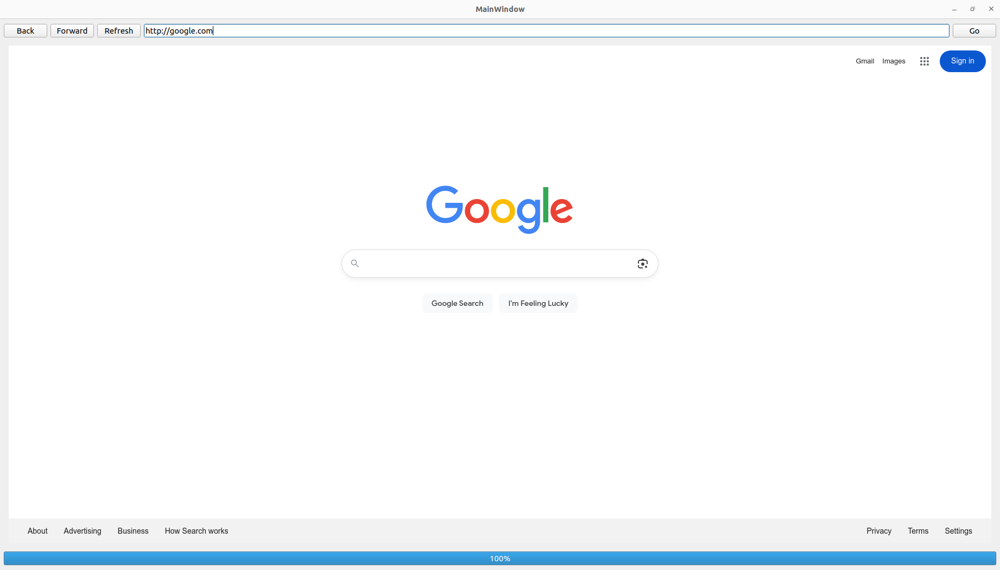

# 💻 Qt5 GUI Exercises

Practical GUI examples implemented in **C++** using **Qt5**, based on the book *"Hands-On GUI Programming with C++ and Qt5"*.  
Each folder contains a small project demonstrating concepts like widgets, layouts, signals & slots, and event handling.



---

## 📦 How to Build
1. Make sure **Qt5** and **CMake** are installed.  
2. In each folder, create a `build` directory:  
   ```bash
   mkdir build && cd build
   cmake ..
   make

